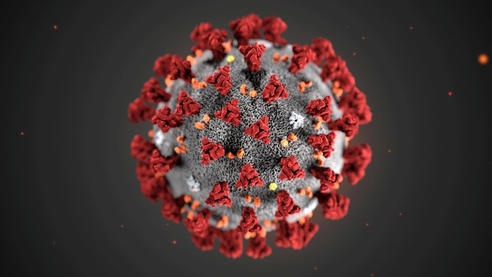

# CORONA VIRUS DISEASE
> Project นี้เป็นการนำอัตราการติดเชื้อโควิด 19 และอัตราการเสียชีวิตจากเชื้อโควิด 19 มาสร้างเป็นกราฟเพื่อนำเสนอ
> ข้อมูลในด้านต่างๆ เช่น อายุ เพศ ว่าจำนวนเท่านี้มีอัตราการติดเชื้อและอัตราการเสียชีวิตเท่าไรและนำข้อมูลดังกล่าวมา
> วิเคราะห์ต่อพร้อมกับนำเสนอความรู้เรื่องที่มาของเชื้อโควิด 19 วิธีการป้องกันตัวเองว่าควรทำอย่าไรและแพร่เชื่อได้อย่างไร 
> เพื่อให้รู้จักป้องกันตัวเองให้ห่างไกลจากโควิด 19 

### Website : http://www.it.kmitl.ac.th/~it63070016/project/docs/index.html
### Youtube : https://www.youtube.com/watch?v=xqYHB0VTs14&feature=youtu.be
# Team
> 1. 63070014 นางสาวขวัญพิชชา อิ่มโดด
> 2. 63070015 นางสาวคณากานต์ ศรีสมบูรณ์สุข
> 3. 63070016 นายจักราภัทร สุดใจ
> 4. 63070048 นางสาวณัชชา ธีระแนว
# Reference
> ข้อมูลเบื้องต้นเกี่ยวกับเชื้อไวรัสโคโรน่า2019และอัตราการติดเชื้อ https://www.moph.go.th/

> ข้อมูลอัตราการเสียชีวิต https://en.wikipedia.org/wiki/Template:COVID-19_pandemic_data/Thailand_medical_cases
